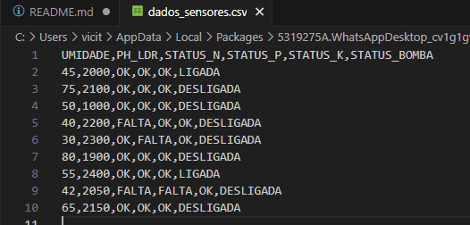
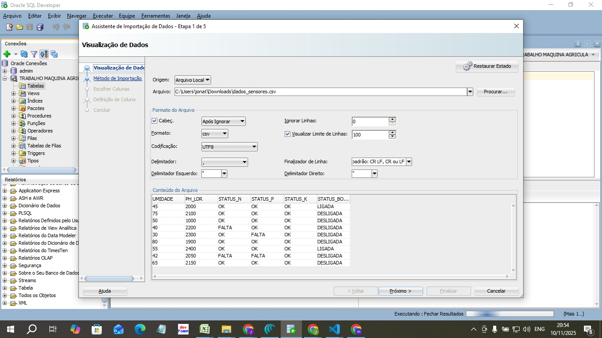
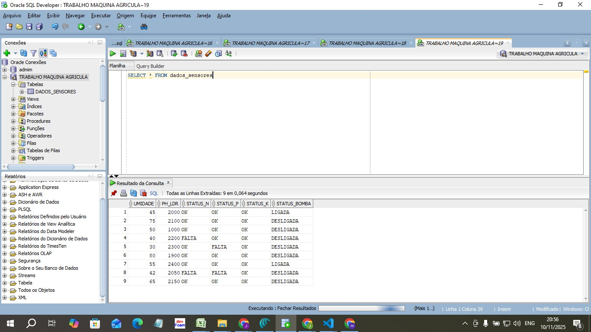

# 🚜 FarmTech Solutions: PBL Fase 3 – Banco de Dados

Este projeto faz parte do PBL (Project-Based Learning) do curso de Inteligência Artificial, focado na criação de soluções para o agronegócio.

Nesta terceira fase, o objetivo foi estruturar e persistir os dados coletados pelos sensores do sistema de irrigação inteligente (Fase 2) em um banco de dados relacional profissional, utilizando o Oracle SQL Developer.

## 1. Processo de Execução

O trabalho seguiu os seguintes passos, conforme o tutorial fornecido:

1.  **Criação do Arquivo de Dados:** Como o projeto da Fase 2 consistia em uma simulação interativa com o ESP32, foi gerado um arquivo `dados_fase2.csv` manual para simular o "log" de dados que os sensores teriam coletado em campo.
2.  **Conexão com Oracle:** Foi estabelecida a conexão com o banco de dados Oracle da FIAP (`oracle.fiap.com.br`) utilizando o Oracle SQL Developer e as credenciais de aluno (RM e data de nascimento).
3.  **Importação de Dados:** Utilizou-se o assistente de importação de dados ("Importa Dados...") para carregar o arquivo `dados_fase2.csv`.
4.  **Definição da Tabela:** Durante a importação, foi criada a tabela `DADOS_SENSORES` (ou o nome que você usou) para armazenar as leituras de umidade, pH (LDR), status dos nutrientes (N, P, K) e o acionamento da bomba.
5.  **Consulta e Validação:** Por fim, foi executada uma consulta `SELECT *` para validar que todos os dados foram importados corretamente para o banco.

## 2. Provas e Demonstração

Abaixo estão os prints de tela que documentam as principais etapas do processo.

### Print 1: Arquivo de Dados da Fase 2

Este é o arquivo `.csv` contendo os dados simulados que foram importados para o banco.

### Print 2: Tela de Importação 

Print do assistente de importação de dados no Oracle SQL Developer.

### Print 3: Consulta SQL 

Este print demonstra a conexão bem-sucedida e a consulta `SELECT *` na tabela criada, provando que os dados da Fase 2 agora estão persistidos no banco de dados Oracle.

## 3. Vídeo de Demonstração

O vídeo abaixo (YouTube, não listado) mostra o repositório organizado e a consulta ao banco de dados Oracle funcionando em tempo real.

https://youtu.be/-w4WnTsVps8

## 4. Código-Fonte (Fase 2)

O código C++ da Fase 2 está na pasta Sistema_irrigacao
